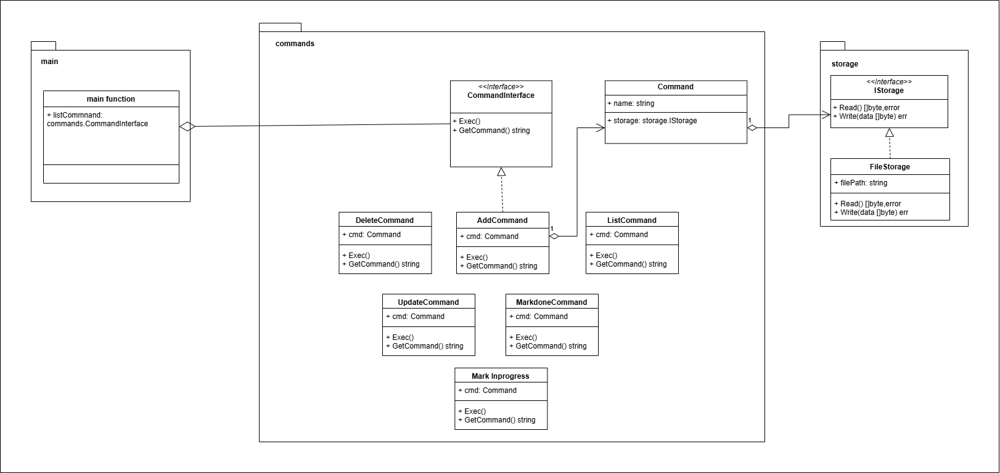
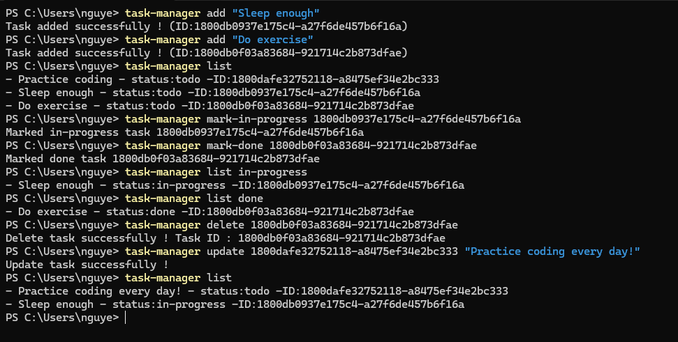

# task-manager-cli
This is project to study BE development follow guide from this : https://roadmap.sh/projects/task-tracker
It is simple cli application to manage user'task.

### Design structure

With this design , I think it can easily change the data storage (current is file storage) and add more command quickly.
### Programming language
I use [Golang](https://go.dev/) for this project.

### Installation
1. Install golang from this link (select version match your system) : https://go.dev/dl/
2. Build the source code

**For Windows 64-bit**
`GOOS=windows GOARCH=amd64 go build -o task-manager.exe ./path/to/package`

**For macOS 64-bit**
`GOOS=darwin GOARCH=amd64 go build -o task-manager ./path/to/package`

**For Linux 64-bit**
`GOOS=linux GOARCH=amd64 go build -o task-manager ./path/to/package`

3. Add execution file to environment variable

#### Usage

